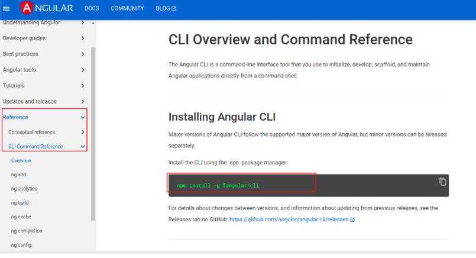
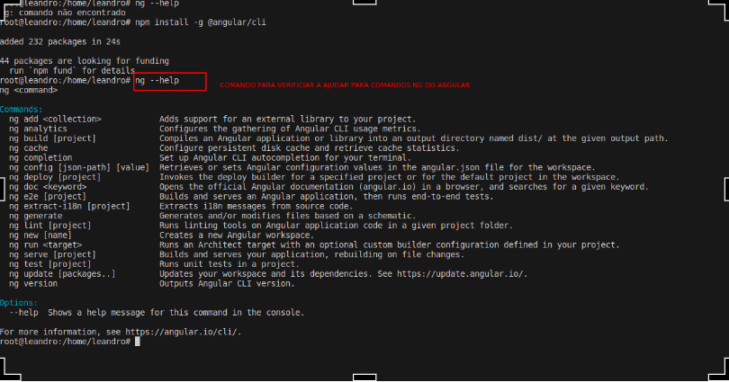
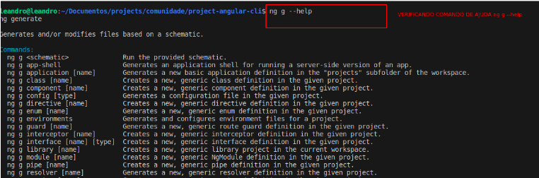

# ProjectAngularCli

This project was generated with [Angular CLI](https://github.com/angular/angular-cli) version 17.2.0.

## Development server

Run `ng serve` for a dev server. Navigate to `http://localhost:4200/`. The application will automatically reload if you change any of the source files.

## Code scaffolding

Run `ng generate component component-name` to generate a new component. You can also use `ng generate directive|pipe|service|class|guard|interface|enum|module`.

## Build

Run `ng build` to build the project. The build artifacts will be stored in the `dist/` directory.

## Running unit tests

Run `ng test` to execute the unit tests via [Karma](https://karma-runner.github.io).

## Running end-to-end tests

Run `ng e2e` to execute the end-to-end tests via a platform of your choice. To use this command, you need to first add a package that implements end-to-end testing capabilities.

## Further help

To get more help on the Angular CLI use `ng help` or go check out the [Angular CLI Overview and Command Reference](https://angular.io/cli) page.

## create new project

To create a new workspace and initial starter app, run the CLI command `ng new `and provide the name `my-app`, as shown here, then answer prompts about features to include:

* `ng new my-app`

## Documentação do projeto

* arquivo: [document angular](https://onedrive.live.com/edit?id=E51732C49692062B!28011&resid=E51732C49692062B!28011&ithint=file%2cdocx&authkey=!AE0NuiWsDsg5Pi8&wdo=2&cid=e51732c49692062b)

* Para iniciamos com angular precisamos do node instalado: https://nodejs.org/en  

* Trabalha com leasy load, importante para carregamento de arquivos pesados 

* Site do framework: https://angular.io/  

* Nova documentação: https://angular.dev/  

* Github do curso: https://github.com/troquatte/curso-angular-latest  

* Instruções do curso: https://vidafullstack.com.br/instrucoes-para-o-curso/  

* Projeto aula javascript: https://github.com/troquatte/curso-javascript  

* Plataforma para build de softwares angular para multiplataformas: https://docs.nativescript.org/  

* Instalando o visionado de NODE.JS: https://www.npmjs.com/package/n  

* Gerenciando Versões do Node.js com o N:  https://www.dio.me/articles/gerenciando-versoes-do-nodejs-com-o-n  

* Instalando o angular CLI: https://angular.io/cli 

